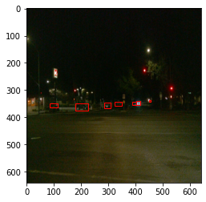
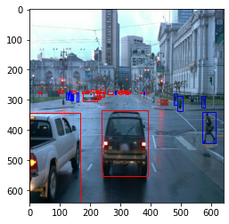
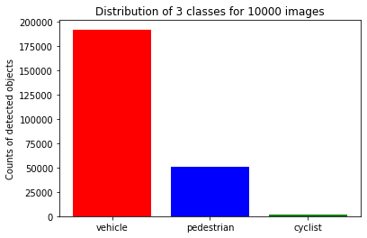
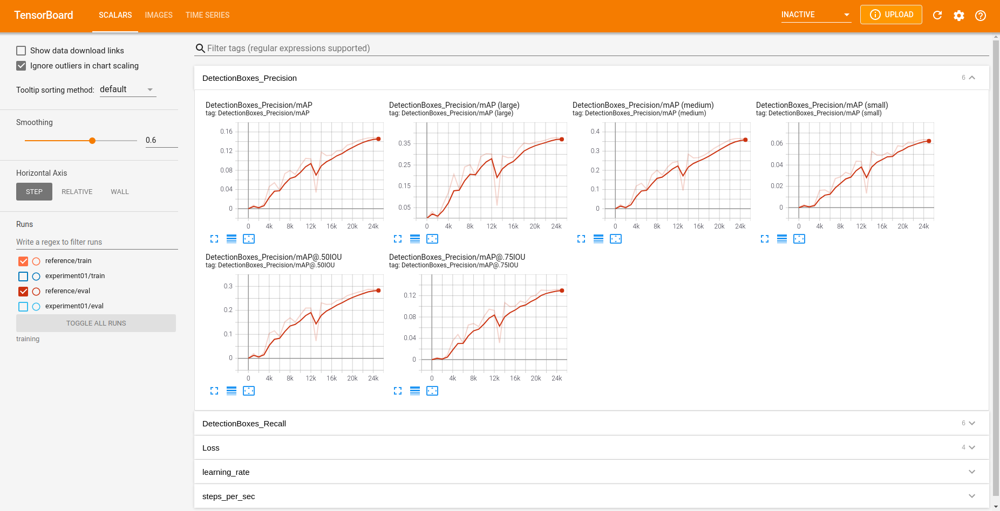
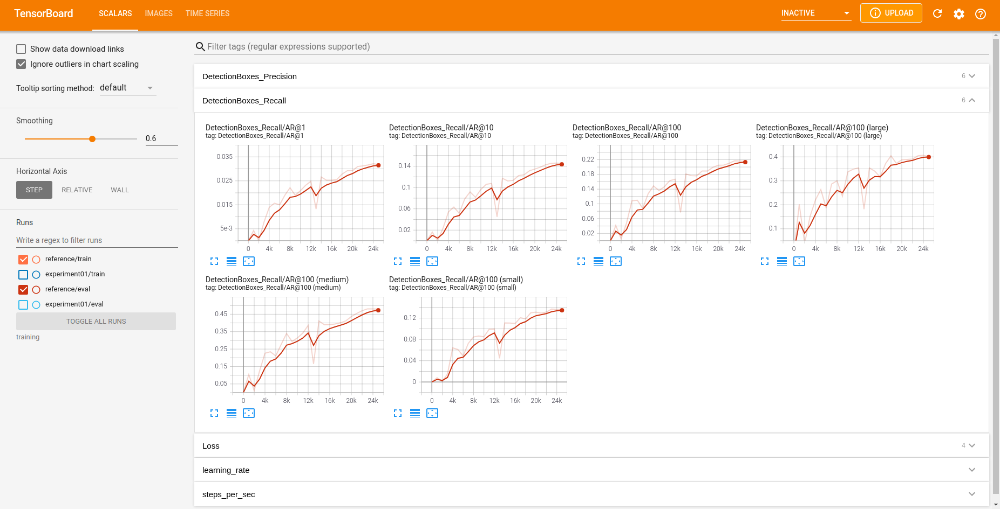
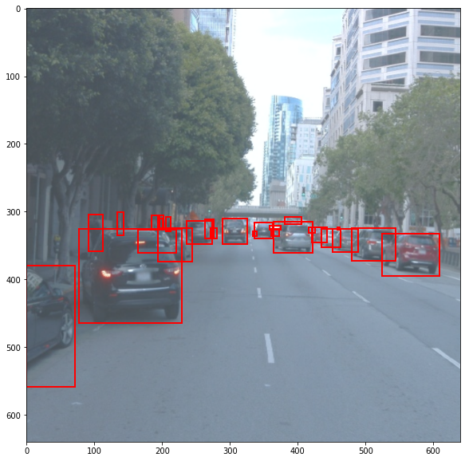
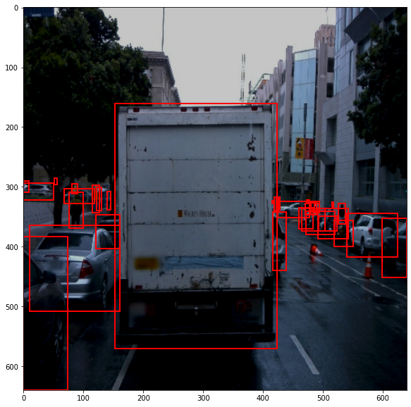
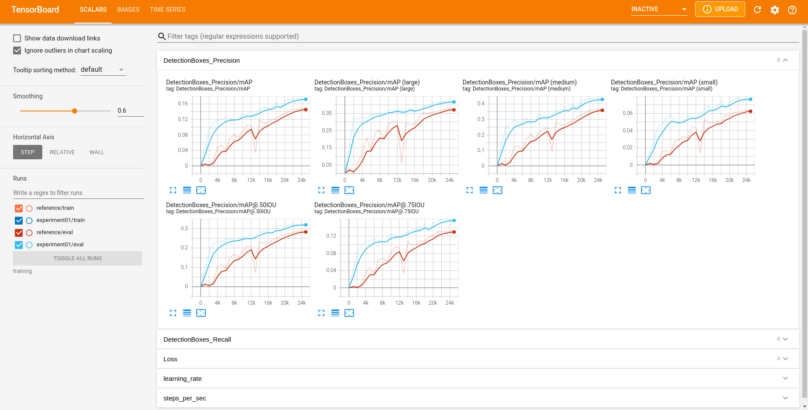
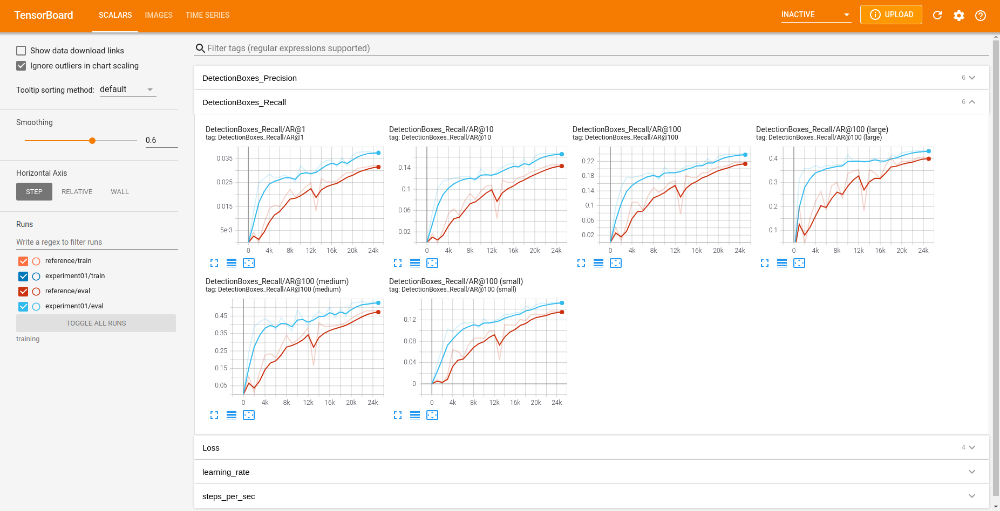

# Object detection in an Urban Environment

## Data

For this project, we will be using data from the [Waymo Open dataset](https://waymo.com/open/). The files can be downloaded directly from the website as tar files or from the [Google Cloud Bucket](https://console.cloud.google.com/storage/browser/waymo_open_dataset_v_1_2_0_individual_files/) as individual tf records. 

## Structure

The data in the classroom workspace will be organized as follows:
```
/data/waymo/
    - contains the tf records in the Tf Object detection api format.

/home/workspace/data/
    - test: contain the test data
    - train: contain the train data
    - val: contain the val data
```

The experiments folder will be organized as follow:
```
experiments/
    - exporter_main_v2.py: to create an inference model
    - model_main_tf2.py: to launch training
    - experiment0/....
    - experiment1/....
    - experiment2/...
    - pretrained-models/: contains the checkpoints of the pretrained models.
```

## Prerequisites

### Local Setup

For local setup if you have your own Nvidia GPU, you can use the provided Dockerfile and requirements in the [build directory](./build).

Follow [the README therein](./build/README.md) to create a docker container and install all prerequisites.

### Classroom Workspace

In the classroom workspace, every library and package should already be installed in your environment. You will not need to make use of `gcloud` to download the images.

## Instructions

### Download and process the data

**Note:** This first step is already done for you in the classroom workspace. You can find the downloaded and processed files within the `/data/waymo/` directory (note that this is different than the `/home/workspace/data` you'll use for splitting )

The first goal of this project is to download the data from the Waymo's Google Cloud bucket to your local machine. For this project, we only need a subset of the data provided (for example, we do not need to use the Lidar data). Therefore, we are going to download and trim immediately each file. In `download_process.py`, you can view the `create_tf_example` function, which will perform this processing. This function takes the components of a Waymo Tf record and saves them in the Tf Object Detection api format. An example of such function is described [here](https://tensorflow-object-detection-api-tutorial.readthedocs.io/en/latest/training.html#create-tensorflow-records). We are already providing the `label_map.pbtxt` file.

You can run the script using the following (you will need to add your desired directory names):
```
python download_process.py --data_dir {processed_file_location} --temp_dir {temp_dir_for_raw_files}
```

You are downloading 100 files so be patient! Once the script is done, you can look inside your data_dir folder to see if the files have been downloaded and processed correctly.


### Exploratory Data Analysis

Now that you have downloaded and processed the data, you should explore the dataset! This is the most important task of any machine learning project. To do so, open the `Exploratory Data Analysis` notebook. In this notebook, your first task will be to implement a `display_instances` function to display images and annotations using `matplotlib`. This should be very similar to the function you created during the course. Once you are done, feel free to spend more time exploring the data and report your findings. Report anything relevant about the dataset in the writeup.

Keep in mind that you should refer to this analysis to create the different spits (training, testing and validation). 


### Create the splits

Now you have become one with the data! Congratulations! How will you use this knowledge to create the different splits: training, validation and testing. There are no single answer to this question but you will need to justify your choice in your submission. You will need to implement the `split_data` function in the `create_splits.py` file. Once you have implemented this function, run it using:
```
python create_splits.py --data_dir /home/workspace/data/
```

NOTE: Keep in mind that your storage is limited. The files should be <ins>moved</ins> and not copied. 

### Edit the config file

Now you are ready for training. As we explain during the course, the Tf Object Detection API relies on **config files**. The config that we will use for this project is `pipeline.config`, which is the config for a SSD Resnet 50 640x640 model. You can learn more about the Single Shot Detector [here](https://arxiv.org/pdf/1512.02325.pdf). 

First, let's download the [pretrained model](http://download.tensorflow.org/models/object_detection/tf2/20200711/ssd_resnet50_v1_fpn_640x640_coco17_tpu-8.tar.gz) and move it to `training/pretrained-models/`. 

Now we need to edit the config files to change the location of the training and validation files, as well as the location of the label_map file, pretrained weights. We also need to adjust the batch size. To do so, run the following:
```
python edit_config.py --train_dir /home/workspace/data/train/ --eval_dir /home/workspace/data/val/ --batch_size 4 --checkpoint ./training/pretrained-models/ssd_resnet50_v1_fpn_640x640_coco17_tpu-8/checkpoint/ckpt-0 --label_map label_map.pbtxt
```
A new config file has been created, `pipeline_new.config`.

### Training

You will now launch your very first experiment with the Tensorflow object detection API. Create a folder `training/reference`. Move the `pipeline_new.config` to this folder. You will now have to launch two processes: 
* a training process:
```
python model_main_tf2.py --model_dir=training/reference/ --pipeline_config_path=training/reference/pipeline_new.config
```
* an evaluation process:
```
python model_main_tf2.py --model_dir=training/reference/ --pipeline_config_path=training/reference/pipeline_new.config --checkpoint_dir=training/reference/
```

NOTE: both processes will display some Tensorflow warnings.

To monitor the training, you can launch a tensorboard instance by running `tensorboard --logdir=training`. You will report your findings in the writeup. 

### Improve the performances

Most likely, this initial experiment did not yield optimal results. However, you can make multiple changes to the config file to improve this model. One obvious change consists in improving the data augmentation strategy. The [`preprocessor.proto`](https://github.com/tensorflow/models/blob/master/research/object_detection/protos/preprocessor.proto) file contains the different data augmentation method available in the Tf Object Detection API. To help you visualize these augmentations, we are providing a notebook: `Explore augmentations.ipynb`. Using this notebook, try different data augmentation combinations and select the one you think is optimal for our dataset. Justify your choices in the writeup. 

Keep in mind that the following are also available:
* experiment with the optimizer: type of optimizer, learning rate, scheduler etc
* experiment with the architecture. The Tf Object Detection API [model zoo](https://github.com/tensorflow/models/blob/master/research/object_detection/g3doc/tf2_detection_zoo.md) offers many architectures. Keep in mind that the `pipeline.config` file is unique for each architecture and you will have to edit it. 

## Submission

### **Project overview**

Object detection in an urban environment is a challenging task of self driving car system, since the cars must classify multiple objects in the field of view. This repository contains the first project of nanodegree program of Udacity Self Driving Car. In this project, tensorflow object detection API is used for detection of multiple object, such as cars, pedestrians and cyclists based on the visual information. The implementation uses the Waymo dataset, which can be downloaded from the [Google Cloud Storage Bucket](https://console.cloud.google.com/storage/browser/waymo_open_dataset_v_1_2_0_individual_files/). 

This project starts with an extensive data analysis including computation of label distributions, display of sample images including bounding boxes, and checking for object occlusions.

This analysis is used for decision of meaningful augmentation of images for the project. Then, a pretrained neural network is trained to detect and classify multiple objects. The training results is monitored with TensorBoard. Based on the monitoring and recorded training and evaluation result, necessary steps for improvement of model performance are analyzed and conducted.

### **Set up**

To use the project repository, GPU system should be available. Following analysis and results are produced by using Nvidia Geforce 1080 Ti in the local machine. If local installation is planned, you can follow either the description in the section [Prerequisites](##Prerequisites) or you can install the required python packages in your virtual environment by using [requirements.txt](./build/requirements.txt).

### **Dataset**
#### Dataset analysis

The waymo dataset includes information about bounding boxes for each image. The objects can be clearly visualized with those boxes and also labeling of classes is included in the dataset. In this study, we have vehicles, pedestrians and cyclists. The images show different scenes, such as different traffic situations, light condition (daytime or night) and also different weather condition. Due to the diverse circumstances, the images capture objects with different quality. Below you can see an example of image recorded in dark and few traffics on the road.



On the other hand, as mentioned, some images have different classes, such as pedestrians marked with blue bounding boxes in the below image.



The classification task for such different scenes requires a dataset with uniformly distributed classes. It helps the classifier to learn diverse features which are the key distinguishing different classes. However, the dataset analysis shows the imbalance of classes in the dataset. As depicted in the below figure, the amount of cyclists (green) is very small compared to the other labels. This might cause poor performance of classification of cyclists.



#### Cross validation
100 tfrecord files are used for training, testing and validaiton. First, the files are shuffled randomly. Random shuffling helps reducing imbalance of classes. Then, 70% of shuffled dataset is used for training, 20% is prepared for validation and 10% is splitted as test dataset to evaluate the model. The proportion ensures that sufficient data is available for training and validation. Once the training and validation are done, 10 percent of dataset is used for testing models. Furthermore, the split helps avoid overfitting of classifier.

### **Training**
#### Reference experiment
This section should detail the results of the reference experiment. It should includes training metrics and a detailed explanation of the algorithm's performances.

In this study, the residual network model ([Resnet](http://download.tensorflow.org/models/object_detection/tf2/20200711/ssd_resnet50_v1_fpn_640x640_coco17_tpu-8.tar.gz)) is taken as reference. The model is configured with randomly cropping images and is trained with the batch size of 4 and following optimizer setup is used:

```
optimizer {
    momentum_optimizer {
      learning_rate {
        cosine_decay_learning_rate {
          learning_rate_base: 0.04
          total_steps: 25000
          warmup_learning_rate: 0.013333
          warmup_steps: 2000
        }
      }
      momentum_optimizer_value: 0.9
    }
    use_moving_average: false
  }
```

To analyze the training process, Tensorboard is used. Orange line indicates training loss of reference model and the red line shows the validation loss of reference model. Both losses tend to decrease, however the validation loss is much higher than training loss. This is a sign that the model is overfitting. 


The performance of classifier model is evaluated by the metrics: Precision and Recall. They tend to increase, but the performance needs to be improved with appropriate measures. 





#### Improve on the reference
This section should highlight the different strategies you adopted to improve your model. It should contain relevant figures and details of your findings.
 
To improve on the baseline model, data augmentation is taken as measures to avoid overfitting problem and increase the classification performance. The rgb image is converted to grayscale with probability of 0.3:

```
  data_augmentation_options {
    random_rgb_to_gray {
    probability: 0.3
    }
  }
```


To highlight objects on the image, the brightness is increased to 0.3.

```
  data_augmentation_options {
    random_adjust_brightness {
    max_delta: 0.3
    }
  }
```

Bright image:



Dark image:



Furthermore, the contrast values are limited between 0.6 and 1.0 to highlight the lightning points.

```
  data_augmentation_options {
    random_adjust_contrast {
    min_delta: 0.6
    max_delta: 1.0
    }
  }
```

The analysis is performed in the jupyter notebook "Explore augmentations.ipynb"

After the data augmentation, the model is trained and evaluated. The results are depicted below:

Training (blue) and validation loss (light blue) of experiment 01:


Precision (light blue)



Recall (light blue)


Overall, the training and validation loss of augmented model are decreased in comparison with the losses of reference model. Better model performance is observed in the precison and recall curve. The model performance can be improved by using further measures, such as tuning optimization parameter or using other pretrained neural network as baseline.

### **Additional - Creating an animation**
To obtain inference with an animated result and export the trained model, following command can be run:

Export the trained model:
```
python experiments/exporter_main_v2.py --input_type image_tensor --pipeline_config_path training/experiment01/pipeline.config --trained_checkpoint_dir training/experiment01 --output_directory training/experiment01/exported_model/

```

Export animation

```
python inference_video.py --labelmap_path label_map.pbtxt --model_path training/experiment01/exported_model/saved_model --tf_record_path data/processed/test/tf.record --config_path training/experiment01/pipeline_new.config --output_path animation.gif
```
"tf.record" has to be replaced with the file you have in the test data.